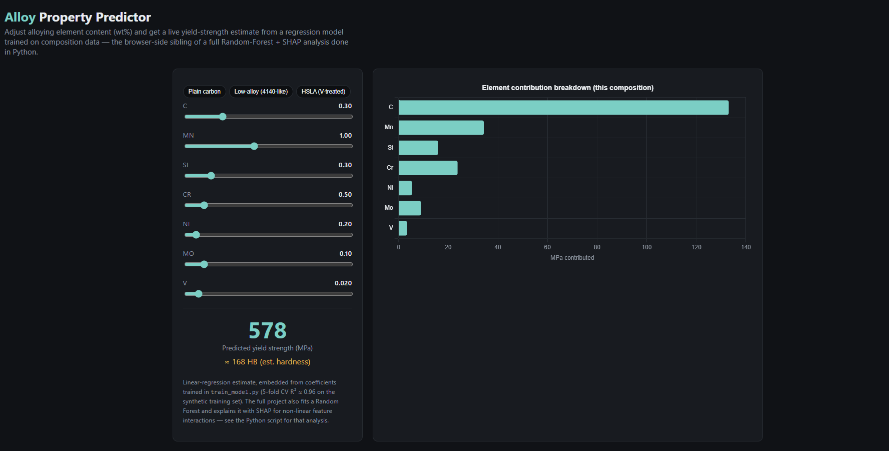
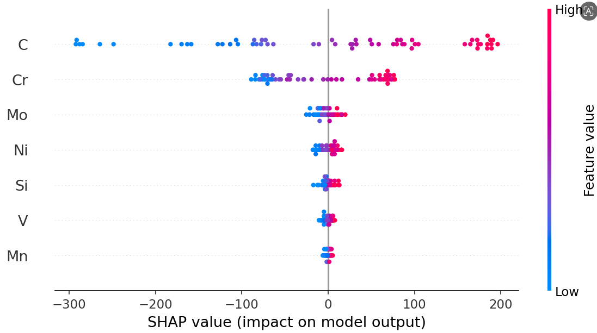

# 🤖 Alloy Property Predictor – Machine Learning Based Yield Strength Prediction

An interactive machine learning application that predicts the yield strength of engineering alloys from their chemical composition. The project combines **Materials Engineering**, **Machine Learning**, and **Web Development** to demonstrate data-driven prediction of mechanical properties using regression models and explainable AI techniques.

---

## 📌 Project Overview

The Alloy Property Predictor estimates alloy yield strength using elemental composition as input.

The project includes:

- 🤖 Machine Learning model training and evaluation
- 📊 Feature importance analysis using SHAP
- 🌐 Interactive web-based alloy property predictor
- 📈 Data visualization and model comparison

---

## ✨ Features

- Predict yield strength from alloy composition
- Interactive composition sliders
- Real-time property prediction
- Compare Linear Regression and Random Forest models
- 5-Fold Cross Validation
- SHAP-based feature importance visualization
- Export trained model and coefficients
- Browser-based prediction without backend

---

## 🛠️ Technologies Used

### Frontend

- HTML5
- CSS3
- JavaScript
- Chart.js

### Machine Learning

- Python
- NumPy
- Pandas
- Scikit-learn
- SHAP
- Joblib
- Matplotlib

---

## ⚙️ Working Principle

The project predicts alloy yield strength from chemical composition using supervised machine learning.

The workflow consists of:

1. Generate a composition dataset for engineering alloys.
2. Train Linear Regression and Random Forest regression models.
3. Evaluate both models using 5-Fold Cross Validation.
4. Interpret feature importance using SHAP.
5. Export model coefficients for browser-based prediction.

The interactive web interface allows users to modify alloy composition and instantly visualize predicted yield strength.

---

## 📊 Machine Learning Pipeline

- Synthetic alloy dataset generation
- Data preprocessing
- Regression model training
- Cross-validation
- Model comparison
- SHAP explainability
- Browser deployment

---

## 📈 Engineering Concepts Used

- Alloy Design
- Chemical Composition Analysis
- Yield Strength Prediction
- Solid Solution Strengthening
- Materials Informatics
- Data-Driven Materials Engineering
- Explainable Artificial Intelligence (XAI)

---

## 📸 Screenshots

### Web Application



### SHAP Feature Importance



---

## 🚀 Installation

### Clone Repository

```bash
git clone https://github.com/Arundhathi2425/Alloy-Property-Predictor.git
cd alloy_predictor
```

### Install Dependencies

```bash
pip install pandas numpy matplotlib scikit-learn shap joblib
```

### Generate Dataset

```bash
python generate_dataset.py
```

### Train Machine Learning Models

```bash
python train_model.py
```

### Launch Web Application

Open

```
index.html
```

in your browser.

---

## 📂 Generated Files

The training pipeline automatically generates:

- Trained Random Forest model
- Linear Regression coefficients
- SHAP summary visualization
- Alloy dataset

---

## 🔮 Future Enhancements

- Train using real experimental alloy datasets
- Predict additional mechanical properties
- Support multiple alloy families
- Deep Learning based prediction models
- FastAPI deployment
- Cloud-hosted prediction service
- Multi-property optimization

---

## 👩‍💻 Author

**Arundhathi**

B.Tech – Metallurgical & Materials Engineering

Indian Institute of Technology Kharagpur

GitHub: https://github.com/Arundhathi2425